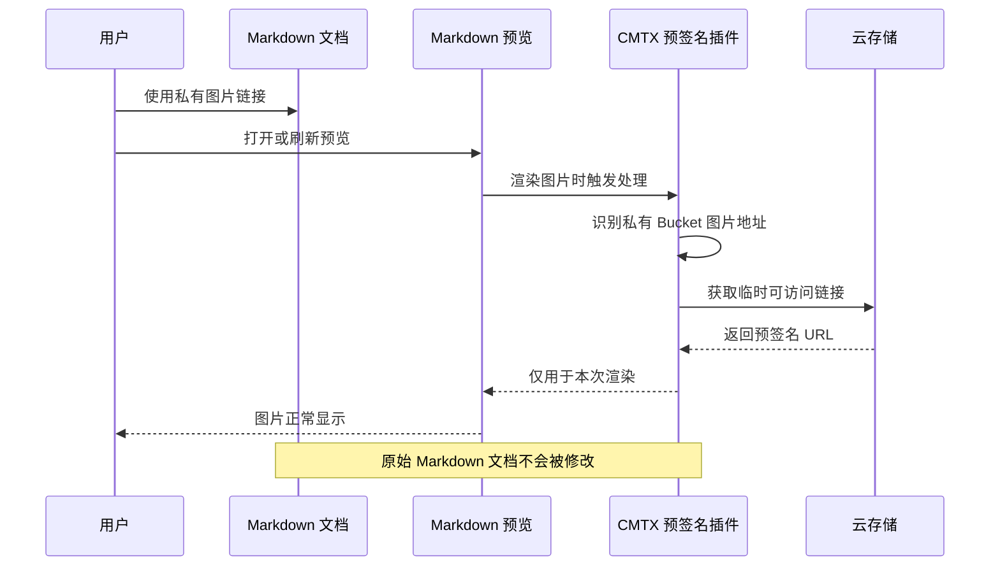

<p align="center">
  
</p>

<p align="center">
  <strong>CMTX</strong> - Markdown 文档处理与发布工具链
</p>

> Logo 采用「文」字篆书，取自崇羲篆體，采用 CC-BY-ND-3.0-TW-or-later 授权，官方页面参考 <https://xiaoxue.iis.sinica.edu.tw/chongxi/copyright.htm>

---

[](https://github.com/cc01cc/cmtx-project/blob/main/LICENSE)
[](https://www.npmjs.com/package/@cmtx/core)

CMTX 是一个基于 pnpm workspace 的多包仓库，提供完整的 Markdown 文档处理与发布工具链。

## 1. 项目特性

- **多平台接入** - CLI 命令行 + VS Code 扩展 + MCP 服务器（AI Agent 接口）
- **智能图片管理** - 本地/远程图片上传、转移、安全删除、智能去重
- **文档处理引擎** - 元数据提取、Frontmatter 操作、格式转换
- **多平台发布适配** - 知乎、微信公众号、CSDN 一键适配与校验
- **模板渲染系统** - Builder 模式模板引擎，灵活配置命名规则
- **云存储集成** - 阿里云 OSS、腾讯云 COS 统一适配器

## 2. 功能展示

TODO: 插入主界面/核心功能演示视频

## 3. 功能介绍

### 3.1. VS Code 扩展

集成到 VS Code 的 Markdown 图片管理和发布工具，提供完整的 GUI 操作体验。

**核心能力：**

- **图片上传/下载** - 通过右键菜单或命令面板一键上传本地图片到云存储，或下载远程图片到本地
- **图片尺寸调整** - 使用快捷键 `Ctrl+Up`/`Ctrl+Down` 快速调整图片宽度
- **格式转换** - Markdown 图片语法与 HTML img 标签双向转换
- **平台适配** - 一键适配文档到知乎、微信公众号、CSDN 等平台
- **预签名 URL 预览** - 私有 Bucket 图片自动生成预签名 URL 实现预览

预签名 URL 预览在渲染阶段生效，不会修改原始 Markdown 文档：



详细功能参见 [packages/vscode-extension/README.md](./packages/vscode-extension/README.md)

### 3.2. CLI 命令行工具

适合自动化脚本和批量处理的命令行工具，支持各类 CI/CD 场景。

**核心命令：**

| 命令           | 说明                                  |
| -------------- | ------------------------------------- |
| `cmtx analyze` | 分析 Markdown 文件中的图片使用情况    |
| `cmtx upload`  | 批量上传本地图片到云存储              |
| `cmtx adapt`   | 适配文档到指定平台（知乎/微信/CSDN）  |
| `cmtx format`  | 格式化文档（图片处理 + front matter） |

TODO: 插入 PNG - `cmtx --help` 命令输出截图

详细功能参见 [packages/cli/README.md](./packages/cli/README.md)

### 3.3. MCP 服务器

为 AI Agent（如 Claude）提供图片管理工具接口，实现 AI 自动管理 Markdown 图片资源。

**核心能力：**

- 实现 Model Context Protocol (MCP) 标准协议
- 提供 `scan.analyze`、`upload.run`、`delete.safe` 等标准工具
- 支持 AI Agent 自动分析、上传、删除 Markdown 中的图片

详细功能参见 [packages/mcp-server/README.md](./packages/mcp-server/README.md)

### 3.4. 底层能力支撑

CMTX 采用分层架构设计，底层包为上层应用提供强大支撑：

| 包             | 说明                                   | 文档                                    |
| -------------- | -------------------------------------- | --------------------------------------- |
| @cmtx/core     | Markdown 图片处理与元数据操作核心库    | [README](./packages/core/README.md)     |
| @cmtx/asset    | 资产管理（上传、转移、智能去重）       | [README](./packages/asset/README.md)    |
| @cmtx/publish  | 多平台适配与发布                       | [README](./packages/publish/README.md)  |
| @cmtx/storage  | 云存储适配器（阿里云 OSS、腾讯云 COS） | [README](./packages/storage/README.md)  |
| @cmtx/template | 模板渲染引擎                           | [README](./packages/template/README.md) |
| @cmtx/fpe-wasm | NIST SP 800-38G FF1 格式保留加密       | [README](./packages/fpe-wasm/README.md) |

## 4. 架构设计

CMTX 采用四层架构设计，确保各组件职责清晰、依赖关系明确：

```
第四层：应用层（面向用户）
  ├─ @cmtx/cli              - 命令行工具
  ├─ @cmtx/mcp-server       - MCP 服务接口
  └─ @cmtx/vscode-extension - VS Code 扩展

第三层：处理层（文档处理）
  └─ @cmtx/publish      - 文章发布与平台适配

第二层：业务编排层
  └─ @cmtx/asset        - 资产管理（上传、转移）

第一层：基础层（核心功能）
  ├─ @cmtx/core         - 文档处理核心库（图片+元数据）
  ├─ @cmtx/template     - 模板渲染引擎
  ├─ @cmtx/storage      - 对象存储适配器
  └─ @cmtx/fpe-wasm     - FF1 格式保留加密
```

**架构特点：**

- 单向依赖（无循环）
- 职责清晰（每层一个角色）
- 易于扩展（新功能知道该放哪里）

### 4.1. 依赖关系表

| 层级 | 包                       | 内部依赖                                                      |
| :--: | ------------------------ | ------------------------------------------------------------- |
|  4   | `@cmtx/cli`              | `@cmtx/core`, `@cmtx/asset`, `@cmtx/publish`                  |
|  4   | `@cmtx/mcp-server`       | `@cmtx/core`, `@cmtx/asset`                                   |
|  4   | `@cmtx/vscode-extension` | `@cmtx/core`, `@cmtx/asset`, `@cmtx/publish`, `@cmtx/storage` |
|  3   | `@cmtx/publish`          | `@cmtx/core`, `@cmtx/asset`, `@cmtx/fpe-wasm`                 |
|  2   | `@cmtx/asset`            | `@cmtx/core`, `@cmtx/storage`, `@cmtx/template`               |
|  1   | `@cmtx/core`             | -                                                             |
|  1   | `@cmtx/template`         | -                                                             |
|  1   | `@cmtx/storage`          | -                                                             |
|  1   | `@cmtx/fpe-wasm`         | -                                                             |

## 5. 快速开始

### 5.1. 安装 CLI

```bash
# 全局安装
npm install -g @cmtx/cli

# 或通过 pnpm
pnpm add -g @cmtx/cli
```

### 5.2. 基本命令

```bash
# 扫描分析 Markdown 文件中的图片
cmtx analyze ./docs

# 上传本地图片到云存储
cmtx upload ./docs --region oss-cn-hangzhou --bucket my-bucket

# 内容适配到知乎
cmtx adapt ./article.md --platform zhihu --out ./zhihu-article.md

# 查看帮助
cmtx --help
```

### 5.3. 安装 VS Code 扩展

在 VS Code 扩展市场搜索 "CMTX" 并安装，或使用快捷键 `Ctrl+P` 输入：

```
ext install cmtx
```

安装后按 `Ctrl+Shift+P` 打开命令面板，输入 "CMTX" 查看所有可用命令。

### 5.4. 配置 MCP 服务器

在 Claude Desktop 或其他支持 MCP 的客户端配置：

```json
{
  "mcpServers": {
    "cmtx": {
      "command": "npx",
      "args": ["-y", "@cmtx/mcp-server"]
    }
  }
}
```

## 6. 项目结构

```
cmtx-project/
├── packages/                    # 各功能包
│   ├── core/                   # 核心文档处理（图片 + 元数据）
│   ├── storage/                # 对象存储适配器
│   ├── asset/                  # 资产管理（上传、转移）
│   ├── template/               # 模板渲染引擎
│   ├── fpe-wasm/               # FF1 格式保留加密（WASM）
│   ├── publish/                # 文章发布与平台适配
│   ├── cli/                    # 命令行工具
│   ├── mcp-server/             # MCP 服务器
│   ├── vscode-extension/       # VS Code 扩展
│   └── markdown-it-presigned-url/  # Markdown-it 插件
├── docs/                       # 项目文档
│   └── adr/                    # 架构决策记录
├── examples/                   # 使用示例
└── scripts/                    # 构建和发布脚本
```

## 7. 模块语法规范

本项目强制使用 **ESM 语法** 编写源代码，构建输出 **ESM + CJS 双格式**，确保最大兼容性。

### 7.1. TypeScript 配置

```json
{
  "compilerOptions": {
    "module": "NodeNext",
    "moduleResolution": "NodeNext",
    "verbatimModuleSyntax": true,
    "esModuleInterop": true
  }
}
```

**关键配置说明：**

| 配置项                 | 值         | 说明                                                            |
| ---------------------- | ---------- | --------------------------------------------------------------- |
| `module`               | `NodeNext` | 根据文件扩展名和 `package.json` 的 `type` 字段决定输出格式      |
| `moduleResolution`     | `NodeNext` | Node.js 模块解析策略                                            |
| `verbatimModuleSyntax` | `true`     | **强制使用标准 ESM 语法**，禁止 `require()` 和 `module.exports` |
| `esModuleInterop`      | `true`     | 改善 CommonJS 依赖的类型推断                                    |

### 7.2. 构建输出

使用 [tsdown](https://tsdown.dev/) 构建工具，同时生成 ESM 和 CJS 两种格式：

```typescript
// tsdown.config.ts
export default defineConfig({
  entry: ['src/index.ts'],
  format: ['esm', 'cjs'],  // 双格式输出
  dts: true,
  shims: true,  // 自动处理 import.meta.url 等
});
```

**输出文件结构：**

```
packages/core/dist/
├── index.mjs        # ESM: import/export 语法
├── index.cjs        # CJS: require/module.exports 语法
├── index.d.mts      # ESM 类型定义
└── index.d.cts      # CJS 类型定义
```

### 7.3. 使用方式

**ESM 导入（推荐）：**

```typescript
import { filterImagesInText } from '@cmtx/core';
import { uploadLocalImageInMarkdown } from '@cmtx/asset';
```

**CJS 导入（兼容旧项目）：**

```typescript
const core = require('@cmtx/core');
const { filterImagesInText } = core;
```

### 7.4. 禁止的语法

```typescript
// ❌ 禁止使用
const foo = require('./foo.js');
module.exports = bar;
exports.baz = qux;

// ✅ 使用标准 ESM 语法
import foo from './foo.js';
export default bar;
export const baz = qux;
```

### 7.5. 特殊场景处理

**动态导入：**

```typescript
import { createRequire } from 'node:module';
const require = createRequire(import.meta.url);
const dynamicModule = require(dynamicPath);
```

**目录定位：**

```typescript
import { fileURLToPath } from 'node:url';
import { dirname, join } from 'node:path';
const __dirname = dirname(fileURLToPath(import.meta.url));
```

**VS Code Extension（保持 CJS）：**

VS Code 扩展使用 esbuild 打包为 CJS 格式，通过 `define` 配置兼容 `import.meta`：

```javascript
// esbuild.config.mjs
export default {
  define: {
    'import.meta': '{}',
    'import.meta.url': 'undefined',
  },
};
```

## 8. 路线图

- [ ] 完善已有功能 - MCP Server 补全 TODO，Asset download 功能
- [ ] 代码优化 - 接口设计统一，性能优化，错误处理增强
- [ ] CLI / MCP 功能补全 - 发布正式版本，补充集成测试
- [ ] 支持更多云存储服务（AWS S3 等）
- [ ] 图片压缩和格式转换功能
- [ ] AI 功能 - 辅助内容优化、标题生成、标签推荐

## 9. 文档

- [架构决策记录 (ADR)](./docs/adr/README.md) - 重要的架构决策文档
- [开发指南](./docs/DEV-005-development_guide.md) - 开发环境设置、构建命令
- [贡献指南](./CONTRIBUTING.md) - 代码风格、提交流程
- [API 文档](./packages/core/docs/api/) - 各包的 API 参考

## 10. 贡献

欢迎贡献！请阅读 [CONTRIBUTING.md](./CONTRIBUTING.md) 了解如何参与项目开发。

## 13. 致谢

本项目在设计和实现过程中参考了以下优秀的开源项目：

| 项目名称                        | 仓库                                           | 版本    | License | 备注                                                            |
| ------------------------------- | ---------------------------------------------- | ------- | ------- | --------------------------------------------------------------- |
| Markdown All in One             | <https://github.com/yzhang-gh/vscode-markdown> | v3.6.3  | MIT     | 参考章节编号功能（Add/Update/Remove Section Numbers）的算法设计 |
| 微信 Markdown 编辑器 (doocs/md) | <https://github.com/doocs/md>                  | v2.1.0  | WTFPL   | 参考微信 Markdown 渲染策略                                      |
| gray-matter                     | <https://github.com/jonschlinkert/gray-matter> | v4.0.3  | MIT     | 参考 frontmatter 解析约定（文件首行、空 frontmatter 处理）      |
| AutoCorrect                     | <https://github.com/huacnlee/autocorrect>      | v2.16.2 | MIT     | 引用实现 CJK 文案自动纠正                                       |

感谢以上项目的作者和贡献者！

## 13. 许可证

Apache-2.0 许可证
